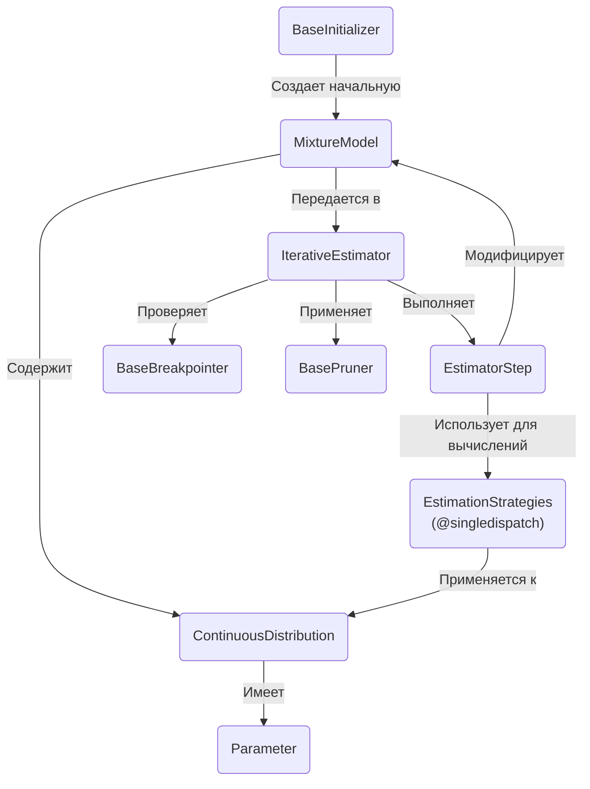
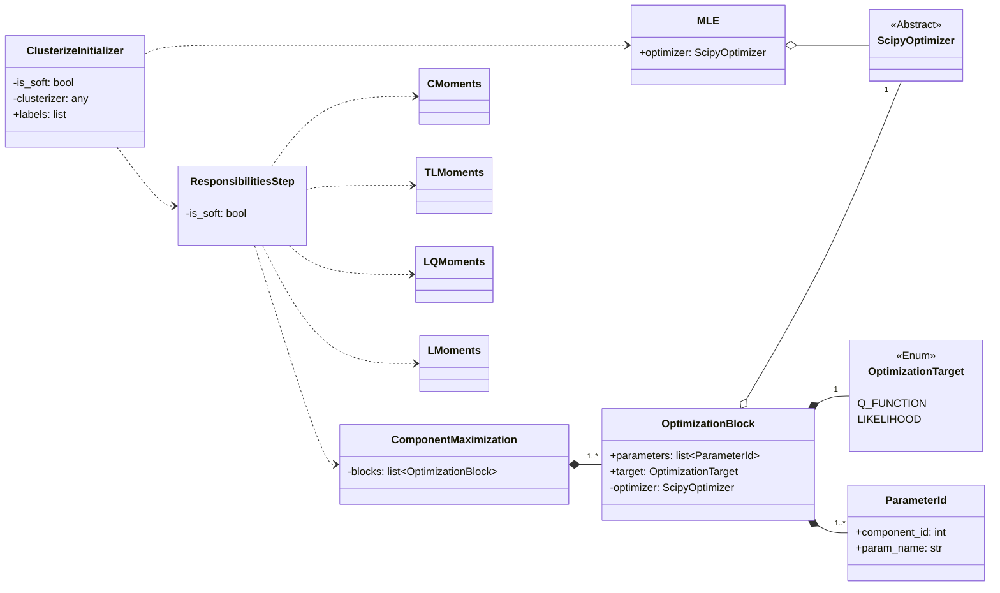
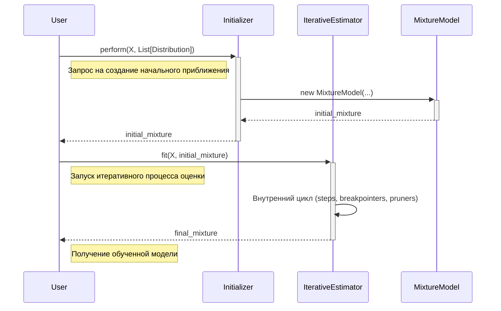
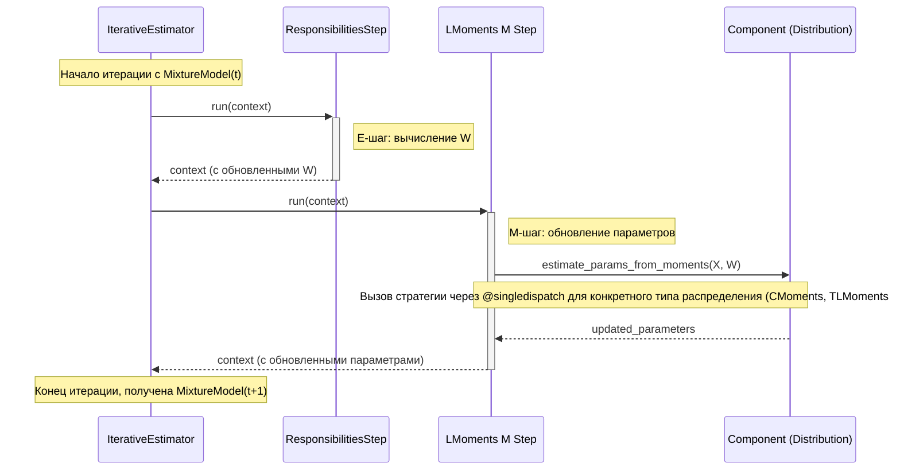
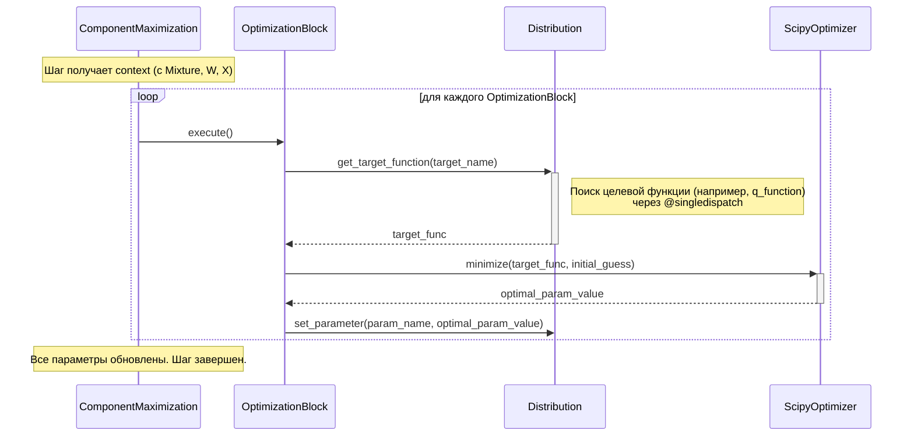

# Содержание

1. **Введение**

   1.1. Назначение библиотеки

   1.2. Цели документации

   1.3. Глоссарий

2. **Архитектурный обзор**

   2.1. Основные принципы

   2.2. Высокоуровневая диаграмма архитектуры

   2.3. Дерево алгоритмов

   2.4. Технологический стек

3. **Архитектурные компоненты**

   3.1. Mpest-core

   3.2. Algorithm

4. **Потоки данных**

5. **Анализ текущей архитектуры**

6. **Примеры (пока псевдокод)**

   

# 1. Введение

## 1.1. Назначение библиотеки

`pysatl-mpest` — это Python-фреймворк, предназначенный для оценки параметров смесей вероятностных распределений.

Ключевой особенностью библиотеки является гибкая и расширяемая архитектура, позволяющая пользователям конструировать кастомные итеративные алгоритмы оценки путем комбинирования различных шагов (например, шагов максимизации, вычисления моментов и т.д.).

На данный момент система позволяет:

1. Описывать непрерывные распределения и их смеси, а так же работать с ними как с объектами теории вероятностей
2. Конструировать и конфигурировать сложные пошаговые алгоритмы оценки параметров смеси:
   - Комбинировать различные шаги алгоритма, например E шаг + LMoments шаг или E шаг + ВашЭкзотическийШаг
   - Настраивать условие остановки алгоритма
   - Настраивать удаление компонент (например если его вес станет ниже какого то порога)


В дальнейшем планируется поддержка:

1. Дискретных и многомерных распределения
2. Более детальной конфигурации пайплайна алгоритма, в частности, поддержка отдельных пайплайнов для некоторых компонент. Возможность fallback'ов, в случае если алгоритм не поддерживает какую то компоненту, кидать warning и менять алгоритм на другой.
3. Поддержка большего числа алгоритмов.
4. Реализация бенчмаркинга и его внедрение в `pysatl-experiment`.


## 1.2 Цели документации

Данный документ преследует следующие цели:

- **Облегчить вхождение новых разработчиков:** Предоставить исчерпывающее описание архитектуры, ключевых компонентов и потоков данных для быстрого погружения в проект.

- **Служить основой для разработки:** Зафиксировать принятые архитектурные решения перед началом активной фазы кодирования.

- **Обеспечить базу для будущего рефакторинга:** Честно проанализировать сильные и слабые стороны текущей архитектуры, выявить потенциальные риски и узкие места, которые могут потребовать пересмотра в будущем.

  

## 1.3 Глоссарий

###  Смесь распределений

Объект представляющий собой взвешенную совокупность распределений. 

Плотность смеси распределений можно задать таким образом:
$$
f(x ~ | ~ F, \Theta, \Omega) = \sum_{k=1}^n \omega_k \cdot f_k(x ~ | ~ \theta_k)
$$
где:

- $F = \{f_1, \dots, f_n\}$ — множество плотностей компонент
- $\Theta = \{\theta_1, \dots, \theta_n\}$ — множество параметров для каждой компоненты
- $\Omega = \{\omega_1, \dots, \omega_n\}$ — множество весов компонент, причем $\sum_{i=1}^n \omega_i = 1$ и $\forall i ~ \omega_i \ge 0$​

Смесь позволяет моделировать более сложные распределения, которые могутвозникать, когда данные происходят из нескольких различных подгрупп.

Пример плотности смеси распределений с двумя Нормальными компонентами:


# 2. Архитектурный обзор

## 2.1. Основные принципы

В основе архитектуры лежат следующие принципы:

- **Композиция над наследованием:** Сложные алгоритмы (`IterativeEstimator`) не наследуются от базового, а "собираются" из атомарных частей: последовательности шагов (`steps`), условий остановки (`breakpointers`) и логики удаления компонент (`pruners`). Это обеспечивает высокую гибкость.
- **Расширяемость:** Система спроектирована так, чтобы ее можно было легко расширять. Добавление новых типов распределений, шагов алгоритма или стратегий оценки не должно требовать изменения существующего кода — только добавления нового. Это достигается за счет использования абстрактных базовых классов и паттерна "Стратегия".
- **Разделение ответственности (Single Responsibility Principle):** Каждый класс имеет одну четкую зону ответственности. `Distribution` описывает математику распределения, `EstimatorStep` выполняет один шаг, `Breakpointer` только проверяет условие остановки.
- **Декомпозиция алгоритмов**: мы не работаем с EM, ELM и остальными алгоритмами как с единым целым, находим в них что то общее и выносим в отдельный шаг. Таким образом, мы получаем "дерево" из шагов, которое позволяет собирать алгоритм как "конструктор". Эта лежит в основе класса `IterativeEstimator`.
- **Явное использование паттернов проектирования:** Архитектура осознанно использует классические паттерны:
  - **Стратегия:** для выбора логики оценки параметров в зависимости от типа распределения.
  - **Цепочка обязанностей (Chain of Responsibility):** рассматривается как возможный паттерн для реализации fallback-логики при обработке ошибок.
  - **Дескриптор**: для инкапсуляции логики работы с параметрами.


## 2.2. Высокоуровневая диаграмма архитектуры





## 2.3. Дерево алгоритмов

### EM-подобное дерево


Архитектура этого дерева реализована таким образом:




## 2.4. Технологический стек

- **Язык:** Python 3.11+
- **Основные библиотеки:**
  - `NumPy`: для всех численных вычислений и работы с многомерными массивами (`ndarray`).
  - `SciPy`: потенциально используется для задач оптимизации внутри `OptimizationBlock` (например, `scipy.optimize`).


# 3. Архитектурные компоненты

## 3.1. Mpest-core

### Continuous distribution

Абстрактный класс распределения.

- **Атрибуты**

  - **name: str**

    Имя распределения

  - **params: set**

    Имена параметров (не уверен что в итоге понадобится)

  - **fixed_parameters: set**
  - Имена зафиксированных параметров

- **Методы**

  - ***\+ ppf(X: ndarray): ndarray***

    Квантиль-функция. Необходима для оценки параметров с помощью LQ-моментов.

  - ***+ pdf(X: ndarray): ndarray***

    Функция плотности. 

  - ***\+ lpdf(X: ndarray): ndarray***

    Логарифм функции плотности.

  - ***+ log_gradients(X: ndarray): ndarray[ndarray]***

    Логарифм градиента по всем незафиксированным параметрам.

  - ***+ generate(size: int): ndarray***

    Сэмплирование выборки размера `size`.
    

  + **\+ loglikelihood(X: ndarray): ndarray**

    Логарифм правдоподобия. Формула одинакова для всех распределений.

  - **\+ q_function(X: ndarray, W: ndarray): ndarray**

    Q-функция. Формула одинакова для всех распределений.

  - **\+ fix_parameter(name: str)**

    Функция заморозки параметров. Если попробовать изменить зафиксированный параметр то получим ошибку.

  - **\+ unfix_parameter(name: str)**
  - Функция разморозки параметров.

- **Мысли**

  Фиксированные параметры необходимы для работы `ComponentMaximization`.


### Parameter

Дескриптор, описывающий параметр распределения. Он отвечает за синхронизацию внутренних и внешних параметров,, а так же их ленивое чтение.


### MixtureModel

Класс смеси распределений.

- **Атрибуты**

  - **\+ components: list[Distribution]**

    Компоненты смеси.

  - **\+ weights: ndarray**

    Веса компонент.

  - **\- logits: ndarray**

    Логиты. Необходимы для численной стабильности и соблюдения инварианта для весов. Можно оптимизировать их напрямую, хз правда понадобится ли.

- **Методы**

  - **\+ pdf(X: ndarray): ndarray**

    Функция плотности.

  - **\- lpdf(X: ndarray): ndarray**

    Логарифм функции плотности.

  - **\+ loglikelihood(X: ndarray): ndarray**

    Логарифм правдоподобия.

  - **\+ q_function(X: ndarray, W: ndarray): ndarray**

    Q-функция.

  - **\+ generate(size: int): ndarray**

    Сэмплирование выборки размера `size`.


## 3.2. Algorithms

### BaseEstimator

Абстрактный класс для всех оценщиков параметров смеси.

- **Атрибуты**

- **Методы**

  - ***+ fit(X, MixtureModel): MixtureModel***

    Абстрактный метод, оценивающий параметры смеси распределений по выборке при известном $\mathcal{F}$
  
- **Доступные оценщики:**

  - **IterativeEstimator**
  - **MLE**


### IterativeEstimator

Конкретный класс, реализующий итеративные алгоритмы оценки параметров смеси распределений.

- **Атрибуты**

  - **\- breakpointers: list[BaseBreakpointer]**

    Условия остановки алгоритма. Не знаю, нужно ли делать разделение на:

    1. Остановка если хотя бы один из брейкпоинтеров сработал

    2. Остановка только если все из брейкпоинтеров сработали

       Во втором случае интуитивно кажется, что алгоритм может оказаться бесконечным (но это не точно)

  - **\- pruners: list[BasePruners]**

    Классы удаляющие компоненты из смеси по некоему условию. Актуален тот же вопрос что и для брейкпоинтеров.

  - **\- steps: list[EstimatorStep]**

    Список последовательности шагов, на каждой итерации алгоритм будет по ним проходить начиная с 0 шага и заканчивая последним.

  - **\+ context: Context | dict**

    Общие данные алгоритма, к которым имеют доступ шаги. Т.к. они выполняются последовательно никакой конкурентности на запись и чтение нет.

    Не знаю что лучше: сделать дикт или отдельный датакласс:

    1. В случае с диктом, необходимо четко писать ключи без ошибок и т.д., может быть неудобным дебажить
    2. В случае с контекстом, боюсь он может очень сильно разрастись, т.к. различные ветви дерева доступных шагов могут использовать различные конфигурации полей, и все их сувать в контекст как то странно...

- **Методы**

  - **\- validate()**

    Функция для валидации конфигурации алгоритма. Проверяет:

    - Что все шаги могут друг за другом идти.
    - Применимость каждого шага к компонентам. Если видит, что шаг неприменим то вызывает fallback (пока не придумано как)

  - **\+ fit(X, mixture): mixture**

    Выполняет каждый элемент из `steps` последовательно. В конце каждой итерации идет проверка на выполнение условия остановки и, если остановка не нужна, проверка на удаление компоненты.

- **Мысли**

  Для поддержки своего пайплайна для каждой компоненты можно добавить что то вроде `global_steps` которые отрабатывают для каждой компоненты и `local_steps` содержащий пайплайны для каждой компоненты (а что если идет сначала шаг из `global_step`, а потом шаг из `local_steps` а потом снова из `global_steps`?)

  Если так делать кстати, то получится распараллелить каждую итерацию (очень предпочтительно!)


### BaseBreakpointer

Абстрактный класс, занимающийся остановкой алгоритма по некоему условию.

- **Атрибуты**

- **Методы**

  - ***\+ check(context: Context): bool***

    Абстрактный метод, который по контексту и некоторому условию понимает, нужно ли остановить алгоритм или нет.


### BasePruner

Абстрактный класс, занимающийся удалением лишних компонент смеси.

- **Атрибуты**

- **Методы**

  - ***\+ prune(context: Context): Context***

    Абстрактный метод, реализующий удаление компоненты из смеси по условию.

    Есть два варианта:

    1. Метод `prune` будет возвращать контекст с уже измененной смесью, откуда удалена компонента/ы
    2. Метод `prune` будет возвращать массив `idx_component` указывающий на то, какие компоненты надо удалить. Этот случай необходим, если я решу сделать композицию алгоритмов.

    

### BaseInitializer

Абстрактный класс, занимающийся инициализацией начального приближение смеси.

- **Атрибуты**

- **Методы**

  - ***\+ perform(X, list[Distribution]): MixtureModel***

    Абстрактный метод, который некоторым образом по выборке и списку распределений подбирает начальное приближение. Это приближение в виде смеси можно передать в объекты, реализующие интерфейс `BaseEstimator`.

- **Мысли**

  Думаю, стоит так же через стратегии (@singledispatch) делать, т.к. инициализировать каждую компоненту надо отдельно.

### EstimatorStep

Абстрактный класс для шагов алгоритмов.

- **Атрибуты**

  - ***+ available_next: list[EstimatorStep]***

    Приватный атрибут, содержащий информацию о том, какой шаг может идти следующим. Надо чтобы последний шаг замыкал итерацию так, чтобы возвращал то, что может обработать первый шаг итерации.

    Например: `EStep -> MStep`, `MStep -> EStep`.

    Возможно стоит заменить на `return_value_names` или что то вроде того.

- **Методы**

  - ***+ run(context: Context): Context***

    Абстрактный метод, запускающий шаг алгоритма. Внутри себя может работать с контекстом, записывая туда информацию необходимую для следующего шага.
  
- **Доступные шаги**

  - **ResponsibilitiesStep**

    Шаг оценки скрытых параметров, возвращающий матрицу ответственностей, содержащей вероятности и использующуюся в последующих шагах.

  - **MomentsSteps** (Conventional moments, L-moments etc.)

    Шаги оценки параметров, основанные на моментах.

  - **ComponentMaximization**

    Про него подробнее дальше.


### Strategies

Стратегии обновления компонент смеси. Реализованы с помощью @singledispatch.

У каждого шага оценки параметров должна быть своя стратегия, например для оптимизации Q-функции внутри ComponentMaximization, в папке `pysatl-mpest/algorithms/strategies`:

```python
@singledispatch
def optimize_q_function(X: ndarray, W: ndarray, optimizer: ScipyOptimizer):
	...
```

Эта функцией будет как бы "родительской" для остальных. Если не реализована конкретная стратегия оптимизации Q-функции для конкретной компоненты, будет вызываться она. Теперь необходимо реализовать эту стратегию для каждой компоненты, например для нормального распределения, и зарегистрировать её:

```python
@optimize_q_function.register(Normal)
def optimize_q_function_normal(X: ndarray, W: ndarray, optimizer: ScipyOptimizer):
	...
```


### ComponentMaximization

Является реализацией абстрактного класса `EstimatorStep`. Требует валидацию при инициализации.

Нужен для оптимизации параметров с помощью численных или аналитических методов. В случае численных методов нужен оптимизатор. Главная "киллерфича" этого класса в том, что можно настраивать заморозку параметров и стратегии оптимизации.

Возможно стоит уметь настраивать порядок оптимизации? Хотя это и так неявно реализовано, т.к. список сам по себе является упорядоченной структурой данных.

#### ParameterId

Является датаклассом, содержащим номер компоненты и имя параметров, которые надо заморозить. Нужен, т.к. из смеси в общем виде параметры не достать и не обработать (т.к. они именованные)

- Атрибуты
  - **+ component_id: int**
  - **+ param_name: str**

####  OptimizationTarget

Является `Enum` для двух стратегий оптимизации: Q-функции и логарифма правдоподобия.

#### OptimizationBlock

Датакласс, содержащий в себе информацию необходимую для конкретного CME шага.

- **Атрибуты**

  - **+ parameters: list[ParameterId]**

    Список параметров, которые необходимо оценить

  - **+ target: OptimizationTarget**

    Стратегии оптимизации.

  - **- optimizer: ScipyOptimizer**

    Оптимизатор, который будет работать в случае отсутствия реализации аналитического решения.

---

- **Атрибуты**

  - **- blocks: list[OptimizationBlock]**

    Атрибут, содержащий стратегию оптимизации для каждой компоненты. Необходимо проверить, чтобы в каждом блоке компонента была одна и та же. Это сознательное ограничение на время, пока не реализуем композицию алгоритмов.

- **Методы**


# 4. Потоки данных

### Поток данных Initializer + IterationEstimator





### Поток данных внутри IterationEstimator с оценкой моментами





### Поток данных внутри ComponentMaximization





# 5. Анализ текущей архитектуры

В данном разделе представлен объективный анализ спроектированной архитектуры, включая её сильные стороны, которые следует развивать, а также слабые стороны, потенциальные риски и открытые вопросы, требующие решения перед или во время активной фазы разработки.

### 5.1. Сильные стороны

Архитектура обладает рядом фундаментальных качеств, которые обеспечивают гибкость и расширяемость системы.

1. **Высокая модульность и гибкость (Композиция > Наследование).**
   Ключевое преимущество архитектуры — отказ от жестких иерархий наследования для алгоритмов. Класс IterativeEstimator не является наследником конкретного EM-алгоритма, а представляет собой конструктор, который "собирается" из атомарных, взаимозаменяемых частей:
   - **Шаги (EstimatorStep):** Любая логика (E-шаг, M-шаг, расчет моментов) может быть инкапсулирована в свой класс.
   - **Условия остановки (BaseBreakpointer):** Логика завершения итераций вынесена и может быть легко заменена или скомбинирована.
   - **Механизмы очистки (BasePruner):** Логика удаления компонент также является независимым модулем.
     Это позволяет пользователям библиотеки с минимальными усилиями создавать кастомные итеративные алгоритмы, комбинируя шаги в нужной последовательности.
2. **Простая расширяемость.**
   Система спроектирована для легкого расширения. Добавление новой функциональности сводится к созданию новых классов, реализующих четко определенные абстрактные интерфейсы:
   - **Новое распределение:** Создать наследника `ContinuousDistribution` и реализовать его математику.
   - **Новый шаг алгоритма:** Создать наследника `EstimatorStep`.
   - **Новая стратегия оценки:** Реализовать новую функцию и зарегистрировать ее через `@singledispatch`.
     Такой подход не требует модификации существующего кода ядра, что снижает риск внесения ошибок.
3. **Четкое разделение ответственности (Single Responsibility Principle).**
   Каждый ключевой компонент архитектуры имеет одну, четко очерченную зону ответственности:
   - `MixtureModel` и `ContinuousDistribution` отвечают исключительно за математическое представление моделей.
   - `EstimatorStep` выполняет один конкретный шаг алгоритма.
   - `BaseBreakpointer` только проверяет, нужно ли остановить алгоритм.
   - `EstimationStrategies` инкапсулируют логику вычисления параметров для конкретных типов распределений.
4. **Слабая связанность через паттерн "Стратегия".**
   Использование декоратора `@singledispatch` для реализации `EstimationStrategies` является отличным примером паттерна "Стратегия". `ComponentMaximization` или `MomentsStep` не знают, *как именно* вычислять параметры распределений. Они делегируют эту задачу стратегии, которая автоматически выбирает нужную реализацию в зависимости от типа компоненты. Это радикально снижает связанность между шагами алгоритма и конкретными реализациями распределений.

### 5.2. Слабые стороны и потенциальные риски

Наряду с сильными сторонами, текущий проект архитектуры содержит несколько фундаментальных проблем и рисков, которые необходимо осознавать.

1. **Проблема монолитного Контекста (Context).**
   Дилемма `dict` vs `dataclass`. Вне зависимости от реализации, текущая концепция единого, передаваемого по цепочке объекта Context является главным архитектурным риском.
   - **Неявная связанность:** Шаги становятся неявно связанными через данные в контексте. `ResponsibilitiesStep` должен положить в контекст ключ `'W'`, а `LMomentsMStep` ожидает его там найти. Эта связь нигде формально не определена и полагается на соглашения.
   - **"Магические строки":** При использовании словаря (`dict`) возникает риск опечаток в ключах, что трудно отлаживать.
   - **Разрастание и загрязнение:** По мере добавления новых шагов и веток алгоритмов, `Context` будет разрастаться, содержа поля, необходимые только для некоторых из них. Это усложняет понимание потока данных: какие данные на каком этапе являются актуальными?
2. **Затрудненное распараллеливание.**
   Текущая архитектура **принципиально однопоточная**. Последовательная передача и мутация единого объекта `Context` от шага к шагу делает распараллеливание (например, обработку шагов для разных компонент) крайне сложным. Любая попытка распараллеливания приведет к состоянию гонки (race conditions) за данные в `Context`. Эта цель, упомянутая в "мыслях", требует фундаментального пересмотра потока данных.
3. **Отсутствие формализованной стратегии обработки ошибок (Fallback).**
   Идея fallback-логики и "Цепочки обязанностей" упомянута, но не интегрирована в архитектуру. На данный момент неясно:
   - Что происходит, если шаг `EstimatorStep` не может быть выполнен (например, метод неприменим к компоненте)?
   - Как система должна реагировать? Прервать весь процесс? Попробовать другой шаг?
   - Кто отвечает за эту логику? `IterativeEstimator`? Сам шаг? 
     Отсутствие этого механизма делает систему хрупкой.

### 5.3. Открытые вопросы и направления для развития

На основе анализа, можно сформулировать ключевые архитектурные задачи, которые нужно решить:

1. **Финализация контракта данных (Context).**
   Необходимо принять решение по `Context`. Возможный компромисс — гибридный подход: использовать `dataclass` для обязательных, общих полей (`mixture`, `X`, `weights` и т.д.), а для специфичных данных, которыми обмениваются конкретные шаги, использовать вложенный словарь `extra: dict`. Это сохранит безопасность типов для ядра и гибкость для расширений.
2. **Проектирование механизма Fallback.**
   Следует спроектировать и задокументировать механизм обработки ошибок и отката. Нужно ответить на вопросы:
   - Как шаг сообщает о сбое (через исключение или специальный возвращаемый объект)?
   - Как `IterativeEstimator` настраивается для обработки этих сбоев (например, через список fallback-стратегий)?
3. **Реализация пайплайнов для отдельных компонент.**
   Идея `global_steps` и `local_steps` очень мощная, но она еще больше усложняет проблему контекста. Необходимо четко определить, как будут взаимодействовать глобальный и локальные потоки данных. Будет ли у каждого локального пайплайна свой собственный "дочерний" контекст? Как результаты локальных вычислений будут агрегироваться обратно в глобальный?


# 6. Примеры (пока псевдокод)

#### Создание смеси распределений

```python
# Initialize distributions
normal = Normal(mu=0.0, variance=1.0)
exponential = Exponential(lambda=1)

# Initialize mixture
mixture = MixtureModel(components=[normal, exponential], weights=[0.6, 0.4])
```


#### Запуск алгоритма, связанного с моментами

```python
# True distributions
normal = Normal(mu=0.0, variance=1.0)
exponential = Exponential(lambda=1)

# Mixtures initialization
true_mixture = MixtureModel(components=[normal, exponential], weights=[0.6, 0.4])
base_mixture = MixtureModel(
    components=[Normal(mu=1.0, variance=2.0), Exponential(lambda=0.5)], weights=[0.6, 0.4]
)
X = true_mixture.generation(size=100)

# Config estimator
breakpointer = StepBreakpointer(steps=16)
pruner = TolerancePruner(tol=0.01)

expectation_step = Responsibilities()
moments_step = LMoments()
estimator = IterativeEstimator([breakpointer], [pruner], [expectation_step, moments_step])

# Get result
result_mixture = estimator.fit(X, base_mixture)
```


#### Запуск алгоритма, содержащего ComponentMaximization

```python
# Initialize distributions
normal = Normal(mu=0.0, variance=1.0)
exponential = Exponential(lambda=1)

# Mixture initialization
true_mixture = MixtureModel(components=[normal, exponential], weights=[0.6, 0.4])
base_mixture = MixtureModel(
    components=[Normal(mu=1.0, variance=2.0), Exponential(lambda=0.5)], weights=[0.6, 0.4]
)
X = true_mixture.generation(size=100)

# Config estimator
breakpointer = StepBreakpointer(steps=16)
pruner = TolerancePruner(tol=0.01)

# CME iterations configure
normal_fixed_parameters = [
    ParameterId(0, "mu"), ParameterId(0, "variance")
]
exponential_fixed_parameters = []
blocks = [
    OptimizationBlock(normal_fixed_parameters, Q_FUNCTION, TNC()),
    OptimizationBlock(exponential_fixed_parameters, LIKELIHOOD, BFGS())
]
expectation_step = Responsibilities()
maximization = ComponentMaximization(blocks)

estimator = IterativeEstimator([breakpointer], [pruner], [expectation_step, maximization])

# Get result
result_mixture = estimator.fit(X, base_mixture)
```


#### Запуск с предварительной инициализацией с помощью BaseInitializer

```python
# Initialize distributions
normal = Normal(mu=0.0, variance=1.0)
exponential = Exponential(lambda=1)

# True mixture initialization
true_mixture = MixtureModel(components=[normal, exponential], weights=[0.6, 0.4])
X = true_mixture.generation(size=100)

# Config estimator
breakpointer = StepBreakpointer(steps=16)
pruner = TolerancePruner(tol=0.01)

expectation_step = Responsibilities()
moments_step = LMoments()

# Init base mixture with clusterizer
knn = KNNClassifier(...)
initializer = ClusterizeInitialization(clusterizer=knn)
base_mixture = initializer.perform(X, [Normal, Exponential])

# Get result
estimator = IterativeEstimator([breakpointer], [pruner], [expectation_step, moments_step])
result_mixture = estimator.fit(X, base_mixture)
```

